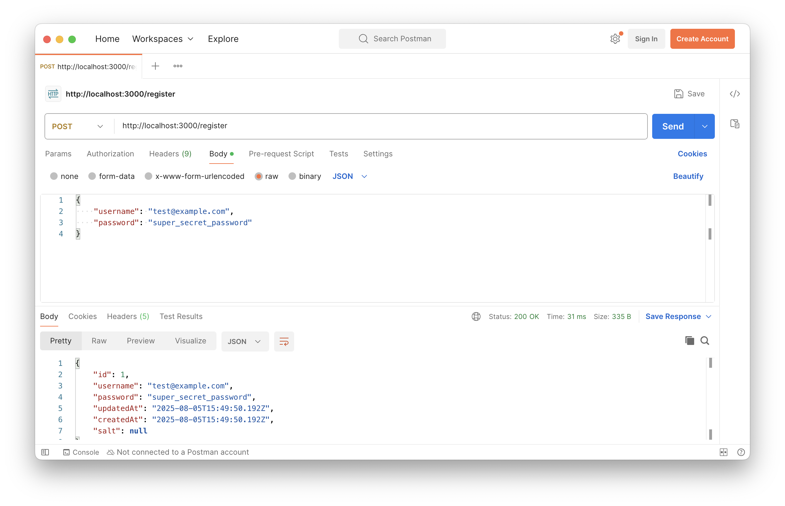
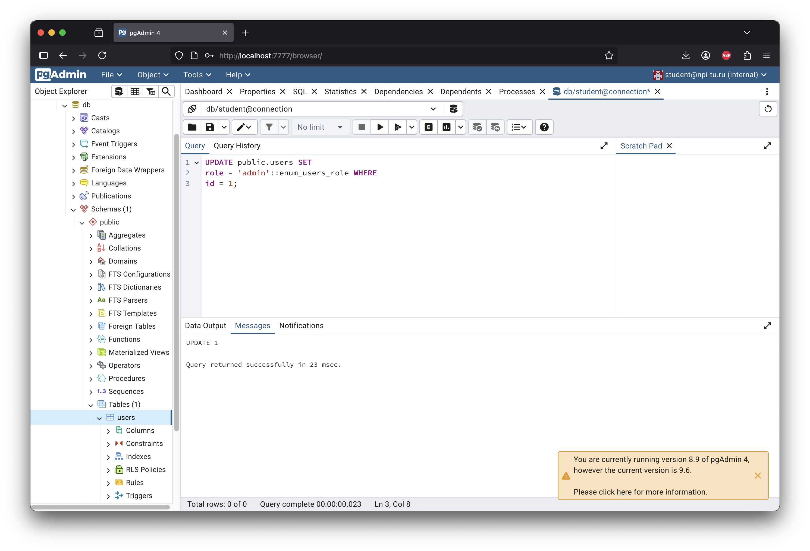
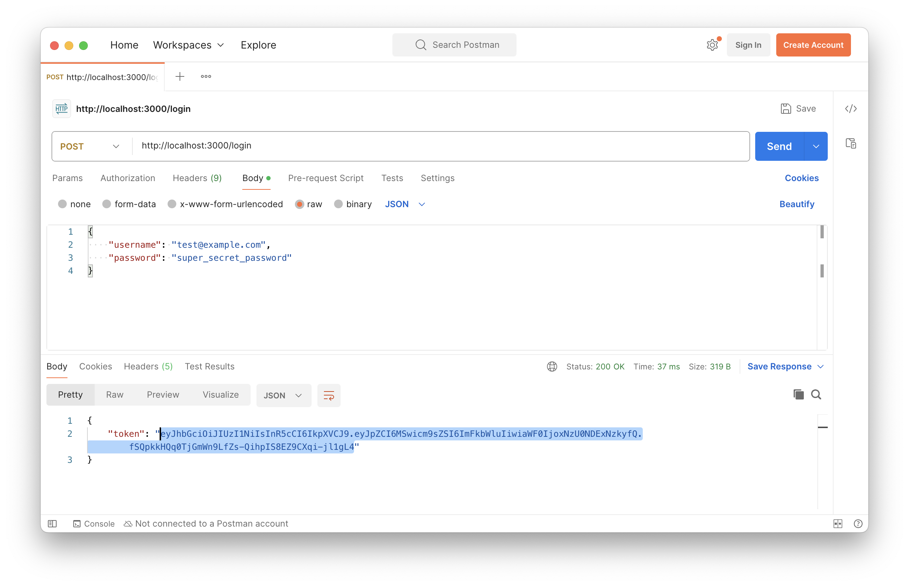
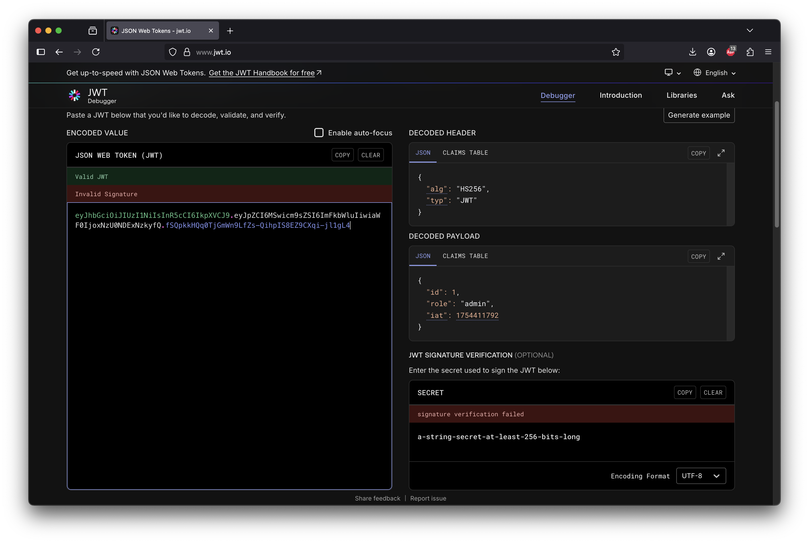

# Практическая работа 4
## Аутентификация, авторизация и идентификация

### Цель работы
Познакомиться с процессом аутентификации, авторизации и идентификации пользователей с использованием JWT токенов

### Технические требования:
- Наличие интернет-соединения
- Наличие [Docker](https://docs.docker.com/desktop/) и [Docker Compose](https://docs.docker.com/compose/install/)
- Наличие [cURL](https://curl.se/download.html) / [Postman](https://www.postman.com/downloads/) / [Insomnia](https://insomnia.rest/download)


### Ход работы:
Данная практическая работа является прямым продолжением практической работы №3, поэтому наличие кода, связанного с хешированием паролей будет приветствоваться.

1. Запустите приложение при помощи команды
`docker compose up -d --build`

1. Убедитесь, что приложение запущено корректно при помощи следующего cURL запроса
```cURL
curl --location 'http://localhost:3000/health'
```

В случае успешного запуска при выполнении cURL запроса отображается следующий текст


3. Выполните настройку подключения и проверку существования таблицы users. Для этого воспользуйтесь информацией, размещенной в разделе “Установка подключения к СУБД PostgreSQL посредством PGAdmin”

4. Выполните следующий cURL запрос для создания (регистрации) нового пользователя

```cURL
curl --location 'http://localhost:3000/register' \
--header 'Content-Type: application/json' \
--data-raw '{
    "username": "test@example.com",
    "password": "super_secret_password"
}'
```



5. В PgAdmin выполните следующий запрос для обновления роли пользователя с идентификатором 1


```SQL
UPDATE public.users SET
role = 'admin'::enum_users_role WHERE
id = 1;
```


6. Создайте нового пользователя

Запрос для импортирования в Postman
```cURL
curl --location 'http://localhost:3000/register' \
--header 'Content-Type: application/json' \
--data-raw '{
    "username": "test2@example.com",
    "password": "super_secret_password"
}'
```

7. Выполните аутентификацию в приложении при помощи следующего cURL запроса, получив при этом JWT токен

```cURL
curl --location 'http://localhost:3000/login' \
--header 'Content-Type: application/json' \
--data-raw '{
    "username": "test@example.com",
    "password": "super_secret_password"
}'
```




8. Выполните декодирование токена с использованием сервиса [JWT Debugger](https://www.jwt.io/), убедившись, что в секции `payload` представлены `id` и `role` пользователя


9.  Модифицируйте исходный код `server.js` реализации авторизации посредством JWT токена.
Итогом данной модификации будет ограничение доступа посредством cURL запросов к определенным роутам в зависимости от роли пользователя.

Так запрос 
```cURL
curl --location 'http://localhost:3000/admins' \
--header 'Authorization: Bearer xxxxxxxxxxxx'
```

должен доступен для пользователей с ролью `admin` и недоступен для пользователей с ролью `user` 

Запрос 
```cURL
curl --location 'http://localhost:3000/users' \
--header 'Authorization: Bearer xxxxxxxxxxxx'
```
должен быть доступен всем пользователям, выполнившим вход

Запрос
```cURL
curl --location 'http://localhost:3000/all'
```
должен быть доступен пользователям всем пользователям вне зависимости от выполнения входа

10.  Модифицируйте код, реализовав хранение и передачу токена посредством HTTP-only Cookie.

### Документация:

[JWT](https://jwt.io/)

[@fastify/jwt](https://github.com/fastify/fastify-jwt)

[@fastify/cookie](https://github.com/fastify/fastify-cookie)

### Контрольные вопросы:
1. Что такое JWT токен?
2. Из каких частей состоит JWT токен?
3. Как обеспечивается неизменность JWT токена?
4. В чем отличие хранения HTTP-only Cookie от хранения токена в LocalStorage? Какой вариант безопаснее и почему?
5. Какие проблемы в безопасности были дополнительно вами найдены?